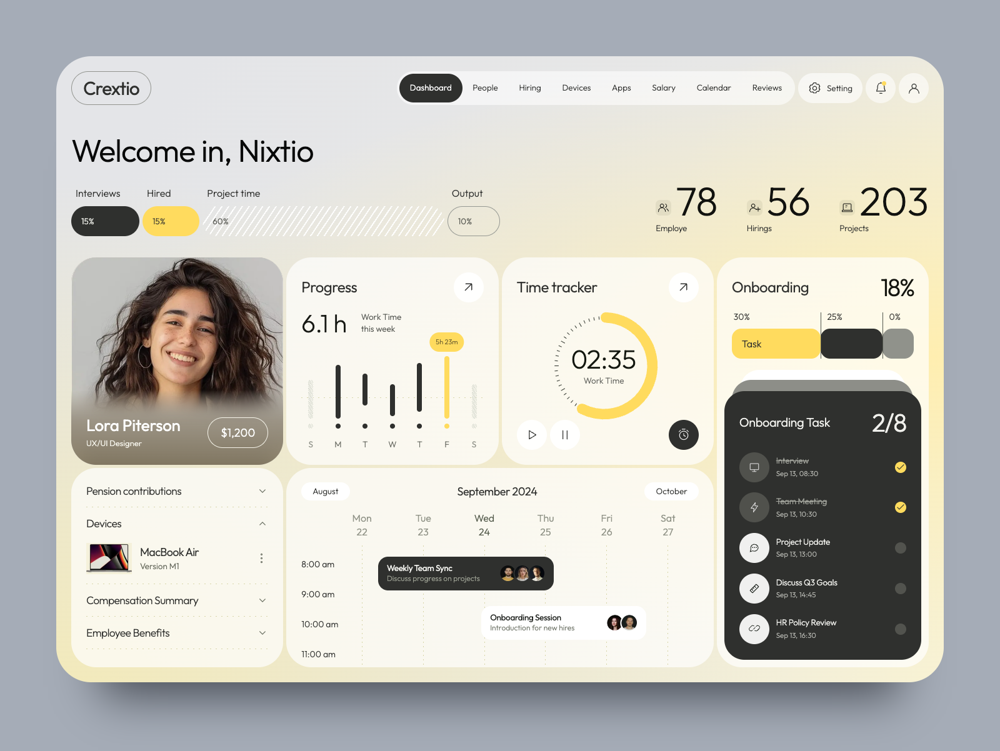

# Daspermind · Perfil docente USICAMM

Perfil de ejemplo de un docente aspirante al proceso de admisión de **USICAMM**, implementado en **React, TypeScript y TSX**. Conserva la estructura y el comportamiento responsive del dashboard anterior. El contenido está en español y utiliza una paleta guinda, dorado y marfil.



## Iniciar el proyecto

Requisitos: **Node.js 24 LTS** (ver `.nvmrc`) y npm. También admite Node 22.12 o superior de la rama 22.

```bash
npm ci
npm run dev
```

Abrir <http://127.0.0.1:5173>. No se necesitan cuentas, claves ni un servidor de API para el modo local.

Para compilar y revisar la versión de producción:

```bash
npm run build
npm run preview
```

Vite sirve los archivos compilados desde `dist/`. La aplicación se ejecuta mediante un servidor HTTP local; no abriendo `index.html` con doble clic.

## Funcionalidad

- Perfil docente, formación inicial, folio de ejemplo y preparación.
- Temporizador con inicio, pausa, reinicio y guardado de tiempo.
- Checklist de participación con porcentaje y contador de pendientes sincronizados.
- Calendario con cambio de mes, estado vacío y detalle de eventos.
- Acordeones, diálogos con control de foco y navegación por teclado.
- Preferencias de persistencia y reducción de movimiento; restauración del estado inicial.
- Diseño adaptable a móvil, tableta y escritorio. La navegación y el calendario tienen desplazamiento interno cuando lo necesitan.

## Estructura

```text
src/
├── app/                       # Composición y proveedores de servicios
├── pages/dashboard/           # Página que coordina el dashboard
├── components/
│   ├── layout/                # Cabecera y navegación
│   └── ui/                    # Iconos, botones, diálogo, toast y errores
├── features/dashboard/
│   ├── components/            # Tarjetas y contenido de los diálogos
│   ├── hooks/                 # Estado, temporizador y calendario
│   ├── model/                 # Esquemas Zod, tipos y navegación
│   └── data/                  # Datos de referencia y estado inicial
├── services/                  # Operaciones independientes de React
├── connectors/
│   ├── contracts/             # Interfaz de los conectores
│   ├── local/                 # Persistencia local del perfil
│   └── http/                  # Cliente HTTP y adaptador para una API
├── config/                    # Configuración de entorno validada
├── hooks/                     # Hooks compartidos
├── lib/                       # Almacenamiento seguro y cálculo de tiempo
├── assets/                    # Fuente local, licencia y recursos docentes
└── styles/                    # Variables, componentes, responsive y estados
tests/e2e/                     # Pruebas de navegador con Playwright
docs/                          # Arquitectura, conectores y validación
.github/workflows/ci.yml        # Comprobaciones automáticas en GitHub
```

Los componentes no leen `localStorage` ni llaman a `fetch`. Usan hooks, los hooks llaman a servicios y los servicios trabajan con un contrato de conector. [Arquitectura detallada](docs/architecture.md).

## Datos y conectores

El modo predeterminado es `local`. Los datos ilustrativos del perfil están en `reference-dashboard.ts`. Las tareas completadas, el tiempo y las preferencias se guardan en `localStorage` bajo `daspermind.usicamm.v1`.

Si el navegador bloquea el almacenamiento, la aplicación conserva los cambios durante la sesión en memoria. El perfil usa una clave propia: no importa ni modifica los avances guardados del prototipo anterior. Puertos diferentes tienen almacenamiento separado.

Para configurar otro origen de datos, copiar `.env.example` a `.env.local`:

```dotenv
VITE_DATA_SOURCE=local
VITE_API_BASE_URL=/api
```

El adaptador HTTP está implementado y probado con respuestas simuladas. **Este repositorio no incluye un backend ni una conexión a datos reales.** Cambiar a `VITE_DATA_SOURCE=http` cuando exista una API que implemente el [contrato documentado](docs/connectors.md).

Las variables `VITE_*` son públicas en el navegador: no colocar claves privadas en ellas.

## Validación

```bash
npm run check            # TypeScript, ESLint, Vitest y build
npm run format:check     # Formato del código y documentación

# Pruebas de navegador sobre el build:
npx playwright install chromium
npm run build
npm run test:e2e
```

Playwright inicia un servidor de preview en el puerto `4184`. Para usar Google Chrome instalado:

```bash
PLAYWRIGHT_CHROMIUM_CHANNEL=chrome npm run test:e2e
```

GitHub Actions ejecuta las comprobaciones en cada push a `main` y en los pull requests. [Alcance de las pruebas](docs/validation.md).

## Referencia visual y recursos

El nombre, folio, cifras y actividades son datos de ejemplo. La agenda es personal y no representa el calendario oficial de admisión. El checklist organiza el seguimiento del usuario; no registra solicitudes ni valida documentos ante USICAMM.

Se mantiene la cuadrícula original de seis tarjetas y sus puntos de adaptación. Los recursos docentes proceden de la carpeta Drive suministrada y se sirven localmente. Outfit mantiene su [licencia SIL Open Font License](src/assets/fonts/OFL-Outfit.txt).

Consulta la [adaptación del perfil y sus fuentes](docs/teacher-profile.md) y el [alcance de la validación](docs/validation.md).
